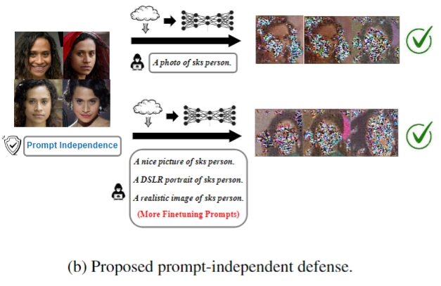

# Diffusion-PID-Protection
Implementation of the ICML 2024 paper titled "PID: Prompt-Independent Data Protection Against Latent Diffusion Models" by Ang Li*, Yichuan Mo, Mingjie Li, [Yisen Wang](yisenwang.github.io).

<center>
  
  #
</center>

TODO:
- [x] Initialize the repo. (2024/5/28)
- [x] Training scripts & implementation of the PID.
- [x] Implementation of the evaluation code.
- [x] Visualizations & training data.
- [] Implementation of the baselines (FSGM, ASPL, AdvDM).

### Protecting images with PID
The minimum implementation of the PID is given in ```PID.py```. Besides, we place clean images from the CelebA-HQ dataset in ```./data/clean_images``` and the images already protected by PID in ```./data/PID_images```
```sh
  sh PID.sh
```


### Fine-tuning
Fine-tuning can be started with a one-line command. Feel free to experiment with different training configurations.
```sh
  sh train_dreambooth.sh # DreamBooth

  sh train_drembooth_lora.sh # LoRA
```

### Evaluation
Implementation of the metrics used in the paper can be found in ```evaluate.py```.
```sh
  sh evaluate.sh
```

### Contact Us
Want to have a discussion with the authors? Please open issues or send emails to charles_li@stu.pku.edu.cn

### Citation
```
Please consider citing our work if you find it helpful!
```

### Acknowledgment
This repo uses some of the code from the links below. We sincerely admire their great work!
- https://huggingface.co/docs/diffusers/en/training/dreambooth
- https://huggingface.co/docs/diffusers/en/training/lora
- https://github.com/VinAIResearch/Anti-DreamBooth/tree/main
- https://github.com/psyker-team/mist
- https://github.com/chaofengc/IQA-PyTorch
- https://github.com/timesler/facenet-pytorch
- https://github.com/krshrimali/No-Reference-Image-Quality-Assessment-using-BRISQUE-Model/tree/master/Python
